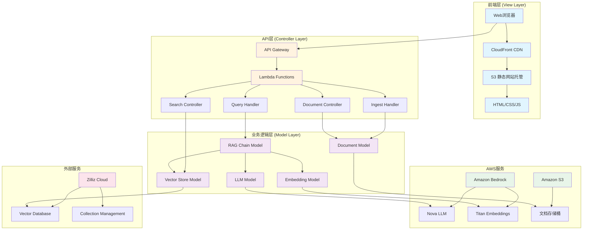
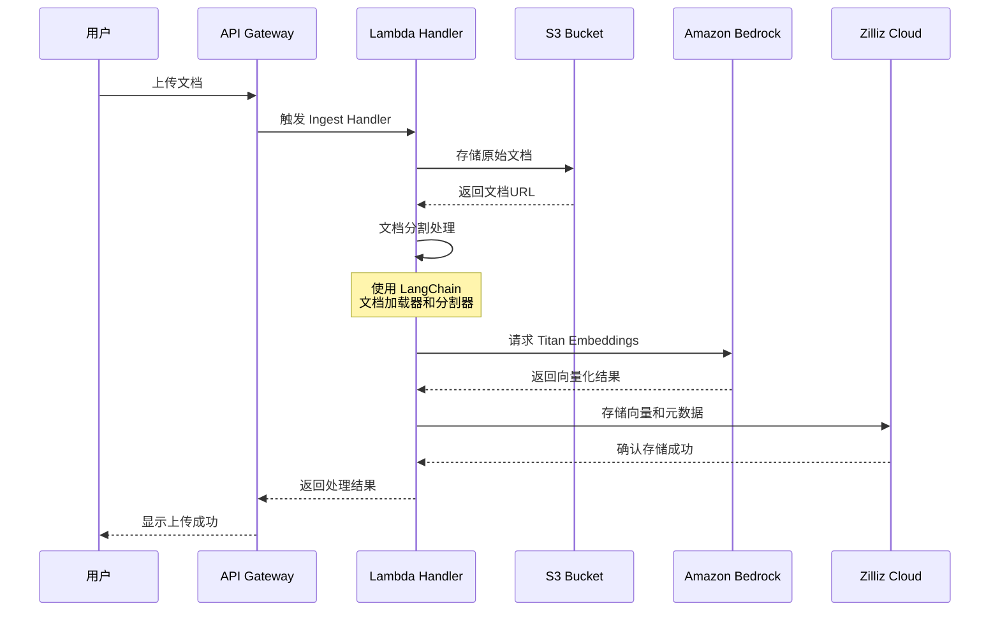
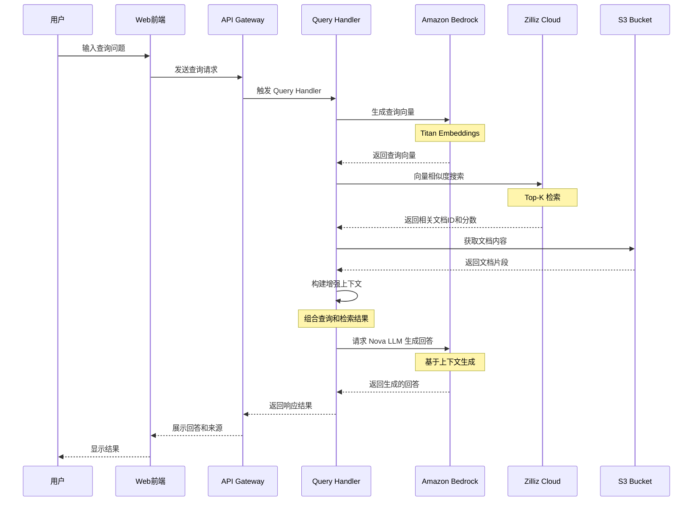
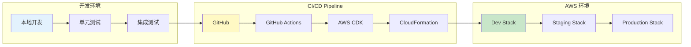
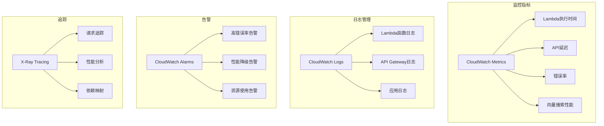
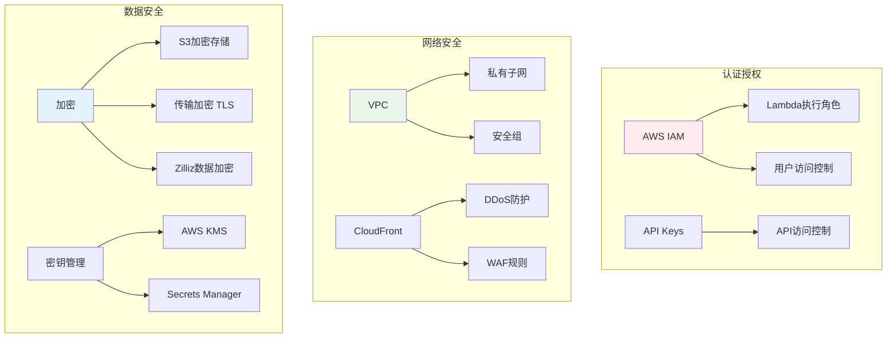

# AWS-Zilliz-RAG 系统架构与数据流程

## 项目简介

基于 AWS 和 Zilliz 的 RAG (Retrieval-Augmented Generation) 应用，采用 MVC 架构模式，使用 LangChain 框架实现文档检索增强生成。

## 系统架构图

## 数据流程图

### 1. 文档摄入流程

### 2. 查询处理流程

## 核心组件说明

### MVC 架构层次

| 层次 | 职责 | 主要组件 |
|------|------|----------|
| **View (视图层)** | 用户界面和数据展示 | Web前端、API响应格式化、模板渲染 |
| **Controller (控制器层)** | 请求处理和流程控制 | Lambda处理器、路由管理、业务流程协调 |
| **Model (模型层)** | 数据和业务逻辑 | 向量存储、LLM集成、文档处理、Embedding生成 |

### AWS 服务集成

| 服务 | 用途 | 配置要点 |
|------|------|----------|
| **Amazon Bedrock** | LLM推理和向量化 | Nova模型用于生成，Titan用于Embedding |
| **Amazon S3** | 文档和静态资源存储 | 分离文档存储桶和前端资源桶 |
| **AWS Lambda** | 无服务器API处理 | Python 3.9运行时，配置适当的内存和超时 |
| **API Gateway** | RESTful API管理 | 配置CORS、认证、限流策略 |
| **CloudFront** | CDN分发 | 缓存策略优化，边缘位置选择 |

### 向量数据库 (Zilliz Cloud)

| 特性 | 说明 |
|------|------|
| **Collection** | 存储文档向量和元数据 |
| **Index Type** | IVF_FLAT 或 HNSW |
| **Metric Type** | L2 或 IP (内积) |
| **Dimension** | 1536 (Titan Embeddings) |

## 数据流特点

### 异步处理
- 文档摄入采用异步处理，支持大批量文档
- 使用 SQS 队列管理处理任务

### 缓存策略
- CloudFront 缓存静态资源
- Lambda 内存缓存热点查询
- Zilliz 缓存频繁访问的向量

### 错误处理
- Lambda 死信队列 (DLQ)
- S3 多版本控制
- API Gateway 错误映射

## 部署架构

## 监控与日志

## 安全架构

## 性能优化策略

| 优化领域 | 策略 | 预期效果 |
|----------|------|----------|
| **向量检索** | 使用 HNSW 索引，优化 ef_construction 参数 | 检索速度提升 50% |
| **文档处理** | 批量处理，并行化 Embedding 生成 | 处理吞吐量提升 3x |
| **API响应** | Lambda 预热，连接池复用 | 冷启动时间减少 70% |
| **前端加载** | CloudFront 缓存，资源压缩 | 页面加载时间减少 60% |
| **模型推理** | Bedrock 模型缓存，批量请求 | 推理成本降低 40% |

## 扩展性设计

- **水平扩展**: Lambda 自动扩展，Zilliz 分片
- **垂直扩展**: 增加 Lambda 内存，升级 Bedrock 配额
- **多区域部署**: CloudFront 全球分发，多区域 S3 复制
- **负载均衡**: API Gateway 自动负载均衡

## 成本优化

- **按需付费**: Lambda 和 Bedrock 按使用量计费
- **预留容量**: Zilliz 预留实例折扣
- **生命周期管理**: S3 智能分层存储
- **监控优化**: 基于 CloudWatch 指标调整资源

---

*本文档使用 Mermaid 图表语法，可在支持 Mermaid 的 Markdown 查看器中正确渲染。*