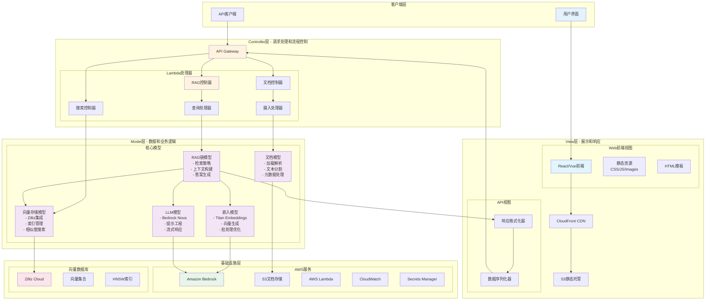
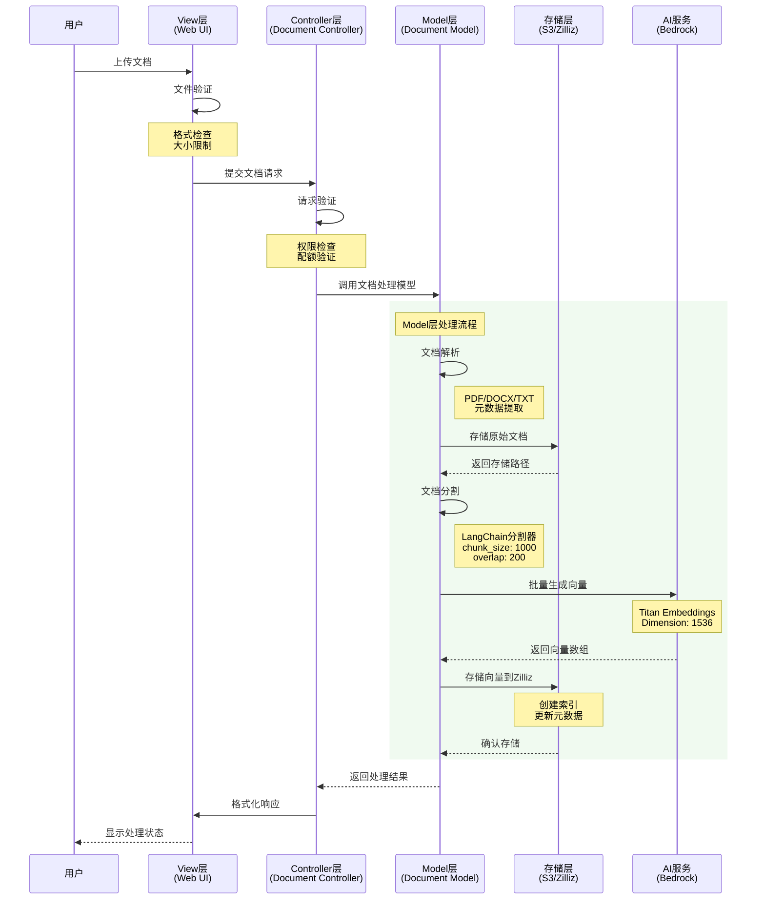
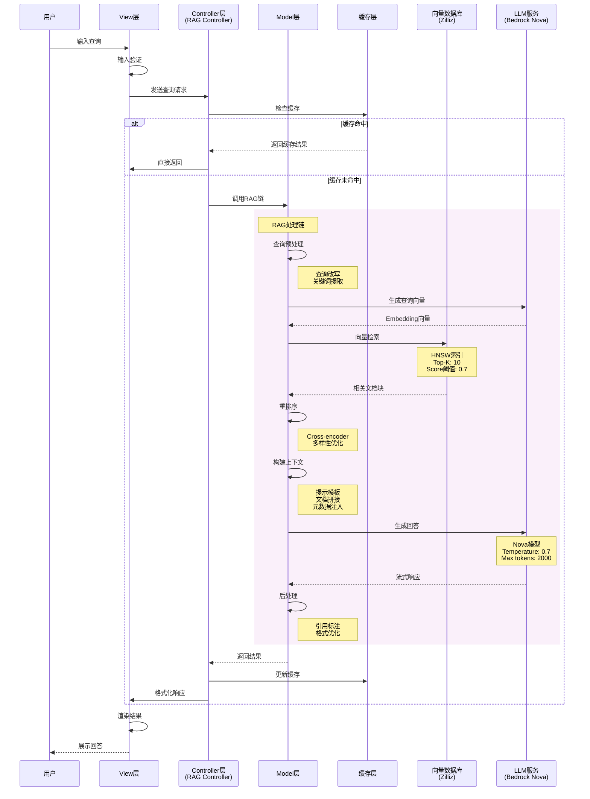
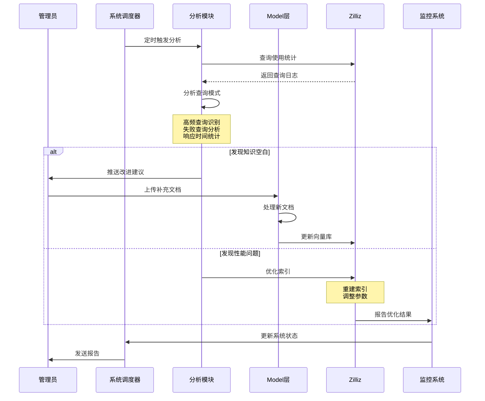
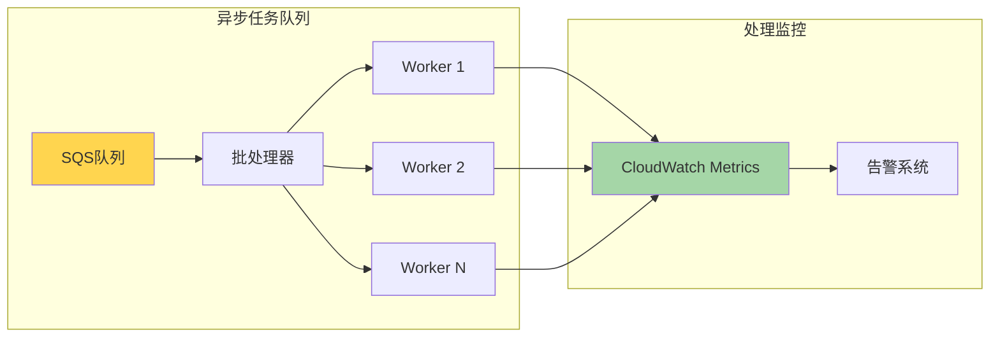

# AWS-Zilliz-RAG 系统架构与数据流程

## 项目简介

基于 AWS 和 Zilliz 的企业级 RAG (Retrieval-Augmented Generation) 应用，采用标准 MVC 架构模式，使用 LangChain 框架实现高性能文档检索增强生成系统。

## 系统架构图



## 数据流程图

### 1. 文档摄入流程（MVC分层）



### 2. RAG查询处理流程（详细版）



### 3. 增量学习流程



## 核心组件说明

### MVC 架构层次详解

| 层次 | 职责 | 主要组件 | 技术实现 |
|------|------|----------|----------|
| **View (视图层)** | 用户界面和数据展示 | • Web前端组件<br/>• API响应格式化器<br/>• 模板引擎<br/>• 静态资源管理 | • React/Vue.js<br/>• Jinja2模板<br/>• JSON序列化<br/>• CDN优化 |
| **Controller (控制器层)** | 请求处理和业务流程控制 | • RAG控制器<br/>• 文档控制器<br/>• 搜索控制器<br/>• Lambda处理器 | • API Gateway路由<br/>• Lambda函数<br/>• 请求验证<br/>• 流程编排 |
| **Model (模型层)** | 数据处理和业务逻辑 | • 文档模型<br/>• 嵌入模型<br/>• 向量存储模型<br/>• LLM模型<br/>• RAG链模型 | • LangChain<br/>• Bedrock SDK<br/>• Zilliz客户端<br/>• Boto3 |

### 技术栈详细配置

#### Amazon Bedrock 配置
```yaml
LLM配置:
  模型: amazon.nova-pro-v1:0
  参数:
    temperature: 0.7
    max_tokens: 2000
    top_p: 0.9
    top_k: 40

Embedding配置:
  模型: amazon.titan-embed-image-v1
  参数:
    dimension: 1536
    batch_size: 100
    normalize: true
```

#### Zilliz Cloud 向量数据库
```yaml
集合配置:
  名称: rag_documents
  向量维度: 1536
  距离度量: IP (内积)
  
索引配置:
  类型: HNSW
  参数:
    M: 16              # 连接数
    ef_construction: 200  # 构建时的搜索范围
    ef_search: 100       # 查询时的搜索范围

分片配置:
  分片数: 2
  副本数: 1
```

#### AWS Lambda 函数配置
```yaml
运行时配置:
  runtime: python3.9
  内存: 3008 MB
  超时: 300 秒
  并发: 100

环境变量:
  BEDROCK_REGION: us-east-1
  ZILLIZ_ENDPOINT: ${ZILLIZ_ENDPOINT}
  S3_BUCKET: ${DOCUMENT_BUCKET}
  LOG_LEVEL: INFO

层配置:
  - langchain-layer
  - numpy-scipy-layer
  - aws-sdk-layer
```

## 数据流特点

### 异步处理架构


### 缓存策略分层
| 缓存层级 | 缓存内容 | TTL | 实现技术 |
|----------|----------|-----|----------|
| **CDN缓存** | 静态资源、API响应 | 24小时 | CloudFront |
| **应用缓存** | 热点查询结果 | 15分钟 | Lambda内存/Redis |
| **向量缓存** | 高频向量检索 | 1小时 | Zilliz内存缓存 |
| **模型缓存** | LLM预测结果 | 30分钟 | DynamoDB |

### 基础设施即代码（CDK Stack）

```yaml
栈结构:
  BaseStack:                 # 基础资源栈
    - VPC和网络配置
    - IAM角色和策略
    - KMS密钥
    
  DataStack:                 # 数据层栈
    - S3存储桶
    - DynamoDB表
    - SQS队列
    
  ComputeStack:              # 计算层栈
    - Lambda函数
    - Lambda层
    - Step Functions
    
  APIStack:                  # API层栈
    - API Gateway
    - CloudFront分发
    - WAF规则
    
```

## 扩展性设计

- **水平扩展**: Lambda 自动扩展，Zilliz 分片
- **负载均衡**: API Gateway 自动负载均衡

## 关键决策点

### 技术选型理由

| 技术选择 | 选择理由 | 备选方案 |
|----------|----------|----------|
| **Amazon Bedrock** | • 无需GPU管理<br/>• 按需付费<br/>• 多模型支持 | OpenAI API, 自托管LLM |
| **Zilliz Cloud** | • 托管服务<br/>• 高性能HNSW<br/>• 自动扩展 | Pinecone, Weaviate, 自建Milvus |
| **LangChain** | • 成熟框架<br/>• 丰富生态<br/>• 活跃社区 | LlamaIndex, 自研框架 |
| **AWS Lambda** | • 无服务器<br/>• 自动扩展<br/>• 成本优化 | ECS, EC2, Kubernetes |
| **MVC架构** | • 清晰分层<br/>• 易于维护<br/>• 团队协作 | 微服务, 单体架构 |

## 项目交付物

- ✅ **架构文档**：完整的系统架构和数据流程图
- ✅ **MVC代码结构**：标准化的三层架构实现
- ✅ **CDK基础设施**：可重复部署的IaC代码
- ✅ **部署指南**：详细的部署和配置步骤

---

*本文档使用 Mermaid 图表语法，可在支持 Mermaid 的 Markdown 查看器中正确渲染。*
*最后更新：2025年8月*