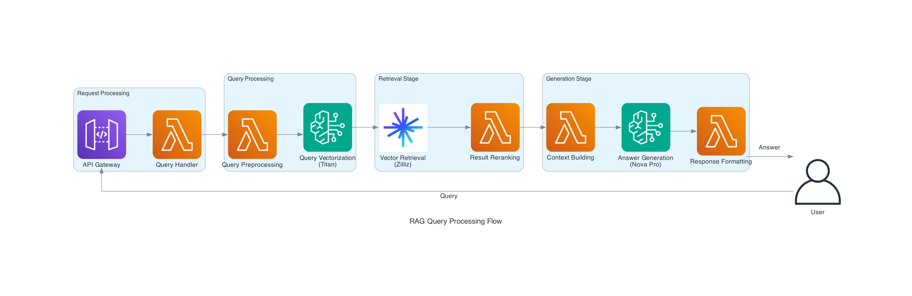
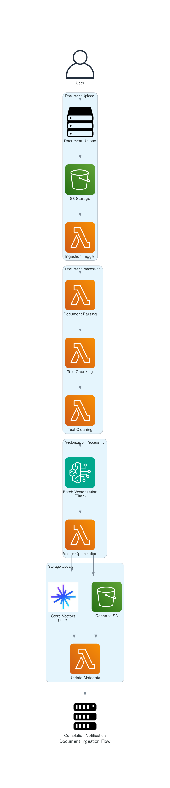

# AWS-Zilliz-RAG System

## Project Overview

An enterprise-grade RAG (Retrieval-Augmented Generation) application based on AWS and Zilliz, implementing a standard MVC architecture pattern with the LangChain framework for high-performance document retrieval augmented generation systems.

## Quick Start

### Prerequisites

- Python 3.9+
- AWS CLI configured
- Node.js 14+ (for CDK)
- Docker (for Lambda layer building)
- Make tool

### Environment Setup

1. **Clone the project**
```bash
git clone https://github.com/your-org/AWS-Zilliz-RAG.git
cd AWS-Zilliz-RAG
```

2. **Install dependencies**
```bash
make install
```

3. **Configure environment variables**
```bash
cp .env.example .env
# Edit the .env file with your configuration
```

Required environment variables:
```bash
# AWS Configuration
AWS_REGION=us-east-1

# Zilliz Configuration
ZILLIZ_ENDPOINT=your-endpoint
ZILLIZ_TOKEN=your-token
ZILLIZ_COLLECTION=rag_collection

# Bedrock Configuration (optional, with defaults)
BEDROCK_MODEL_ID=amazon.nova-pro-v1:0
EMBEDDING_MODEL_ID=amazon.titan-embed-image-v1

# S3 Configuration
S3_BUCKET=rag-storage-bucket
S3_PREFIX=documents/
```

### 🔧 CDK Bootstrap (Required)

**⚠️ Important: CDK Bootstrap must be executed before first deployment**

CDK Bootstrap creates necessary AWS resources for deployment:
```bash
# Initialize CDK environment (only needed once per account/region)
cd infrastructure
npx cdk bootstrap aws://YOUR_ACCOUNT_ID/us-east-1

# Or use Make command
make bootstrap
```

Bootstrap creates:
- S3 bucket (for storing deployment assets)
- IAM roles (for deployment permissions)
- SSM parameters (for version information)

### Using Makefile Commands

This project uses Makefile to manage all operations, providing a clean and consistent command interface.

#### 📋 Common Commands

```bash
# View all available commands
make help

# Show current configuration
make show-config

# Initialize CDK (required for first deployment)
make bootstrap

# Deploy application
make deploy-v2           # Interactive deployment (default target)

# Development related
make test               # Run tests
make lint               # Code linting
make type-check         # Type checking
make ci                 # Complete CI pipeline

# Cleanup and maintenance
make clean              # Clean build artifacts
make kill-cdk           # Kill CDK processes (resolve process conflicts)

# CDK operations
make synth              # Synthesize CloudFormation templates
make diff               # View stack differences
make destroy            # Destroy AWS resources

# Local development
make run-local          # Start local API server
make logs               # View Lambda logs
```

#### 🚀 Deployment Process

**Standard deployment**:
```bash
# 1. Check configuration
make show-config

# 2. Run tests
make test

# 3. View changes to be deployed
make diff

# 4. Execute deployment
make deploy
```

**Quick deployment**:
```bash
make deploy-v2 
```

#### 🔧 Development Workflow

**Daily development**:
```bash
# 1. Clean environment
make clean

# 2. Run code checks
make lint

# 3. Run tests
make test

# 4. Start local service
make run-local
```

**Pre-commit checks**:
```bash
# Run complete CI pipeline
make ci
```

#### 🚨 Troubleshooting

**CDK process conflicts**:
```bash
# If encountering "Another CLI is currently synthing" error
make kill-cdk
make clean
make deploy
```

**View deployment logs**:
```bash
make logs
```

**Clean all resources**:
```bash
make destroy
```

## Project Structure

```
.
├── Makefile            # 🎯 Unified command entry point
├── app/                # Application main directory (MVC architecture)
│   ├── models/         # Model layer - Data and business logic
│   ├── views/          # View layer - Presentation and responses
│   └── controllers/    # Controller layer - Request handling
├── infrastructure/     # AWS CDK infrastructure
│   ├── app.py         # CDK application entry point
│   └── stacks/        # CDK stack definitions
├── config/            # Configuration files
├── tests/             # Test suite
├── docs/              # Documentation
│   └── CDK_BEST_PRACTICES.md  # CDK best practices
└── scripts/           # Utility scripts
```

## Architecture Diagram Generation

This project uses Python `diagrams` library to generate professional architecture diagrams.

### Environment Requirements

- Python 3.9+
- Graphviz (graphics rendering engine)

### Install Dependencies

```bash
# Enter diagrams directory
cd docs/diagrams

# Install Python dependencies
pip install -r requirements.txt

# Install Graphviz (macOS)
brew install graphviz

# Install Graphviz (Ubuntu/Debian)
sudo apt-get install graphviz

# Install Graphviz (CentOS/RHEL)
sudo yum install graphviz
```

### Generate Diagrams

```bash
# Enter project root directory
cd /Users/umatoratatsu/Documents/AWS/AWS-Handson/AWS-Zilliz-RAG

# Generate all architecture diagrams
python docs/diagrams/generate_all.py

# Or generate specific diagrams individually
python docs/diagrams/system_architecture.py
python docs/diagrams/rag_data_flow.py
python docs/diagrams/document_ingestion.py
python docs/diagrams/mvc_architecture.py
```

Generated diagrams will be saved in the `docs/images/` directory:
- `system_architecture.png` - Overall system architecture diagram
- `rag_data_flow.png` - RAG query processing flow diagram
- `document_ingestion.png` - Document ingestion flow diagram
- `mvc_architecture.png` - MVC architecture layer diagram

## System Architecture

### MVC Architecture Layers

| Layer | Responsibility | Main Components |
|-------|----------------|-----------------|
| **View** | User interface and data presentation | Web frontend, API response formatters |
| **Controller** | Request handling and flow control | RAG controller, Document controller, Lambda handlers |
| **Model** | Data processing and business logic | Document model, Embedding model, Vector store model, LLM model |

### Technology Stack

- **Language**: Python 3.9+
- **Frameworks**: LangChain, FastAPI
- **AWS Services**: 
  - Amazon Bedrock (Nova Pro for generation, Titan Multimodal Embeddings for vectorization)
  - AWS Lambda (serverless computing)
  - Amazon S3 (document storage)
  - CloudFront (CDN distribution)
  - API Gateway (RESTful API)
- **Vector Database**: Zilliz Cloud / Milvus
- **Infrastructure**: AWS CDK (Python)
- **CI/CD**: GitHub Actions

### Core Component Overview

| Component | Technology Choice | Purpose | Performance Metrics |
|-----------|-------------------|---------|-------------------|
| LLM Service | Amazon Bedrock Nova Pro | Generate RAG answers | <3s response time |
| Vectorization | Titan Multimodal Embeddings G1 | Document and query vectorization | 1024-dimensional vectors |
| Vector Database | Zilliz Cloud | High-performance vector retrieval | <200ms retrieval |
| Document Storage | Amazon S3 | Raw documents and cache | 99.999999999% durability |
| Compute Service | AWS Lambda | Serverless processing | Auto-scaling |
| CDN | CloudFront | Global content distribution | <100ms latency |
| API Gateway | API Gateway | RESTful API | 10,000 req/s |

## System Architecture Diagrams

### Overall Architecture Diagram


*Figure: AWS-Zilliz-RAG overall system architecture*

### Detailed MVC Architecture Layers


*Figure: Application architecture layers based on MVC pattern*

## Data Flow Diagrams

### RAG Query Processing Flow



*Figure: Complete RAG processing flow from user query to answer generation*

### Document Ingestion Flow



*Figure: Complete flow from document upload, processing, vectorization to storage*

## API Usage

### Query Interface

```bash
# Send query request
curl -X POST https://your-api-url/query \
  -H "Content-Type: application/json" \
  -d '{
    "query": "What is RAG?",
    "top_k": 5
  }'
```

### Document Upload

```bash
# Upload document
curl -X POST https://your-api-url/documents \
  -H "Content-Type: multipart/form-data" \
  -F "file=@document.pdf"
```

## Monitoring and Logging

### CloudWatch Monitoring

```bash
# View real-time logs
make logs

# View specific function logs
aws logs tail /aws/lambda/RAG-Query-dev --follow
```

### Performance Metrics

The system automatically collects the following metrics:
- API response time
- Vector retrieval latency
- LLM generation time
- Error rate and success rate

## Performance Optimization Strategies

### Caching Architecture
- **L1 Memory Cache**: 5-minute TTL, 100MB capacity
- **L2 Redis Cache**: 1-hour TTL, 1GB capacity  
- **L3 S3 Cache**: 1-day TTL, unlimited capacity

### Vector Retrieval Optimization
- IVF_FLAT index with 1024 cluster centers
- Batch embedding generation, 32 documents per batch
- Asynchronous parallel retrieval, up to 10 concurrent

### Lambda Optimization
- Reserved concurrency: Query 100, Ingestion 10
- Memory configuration: Query 1GB, Ingestion 2GB
- Timeout settings: Query 30s, Ingestion 300s

## Monitoring Dashboard

### Key Metrics
- **Query Latency**: P50 <1s, P95 <3s, P99 <5s
- **Success Rate**: >99.9%
- **Concurrent Users**: Real-time monitoring
- **Vector Retrieval Performance**: <200ms
- **LLM Generation Time**: <2s

### CloudWatch Alarms
- High latency alarm: >3s for 2 minutes
- Error rate alarm: 5xx errors >10/minute
- Lambda timeout alarm: Timeout rate >1%
- Cost alarm: Daily spending >80% of budget

## Best Practices

### Security

1. **Never hardcode secrets** - Use environment variables or AWS Secrets Manager
2. **Principle of least privilege** - IAM roles grant only necessary permissions
3. **Encrypt in transit** - All API communications use HTTPS
4. **Regular key rotation** - Periodically update API keys and tokens

### Performance Optimization

1. **Use caching** - Cache common query results
2. **Batch processing** - Batch generate vector embeddings
3. **Asynchronous processing** - Use queues for long-running tasks
4. **Index optimization** - Regularly optimize Zilliz indexes

### Development Standards

1. **Code formatting** - Use Black and isort
2. **Type hints** - All functions use type annotations
3. **Test coverage** - Maintain >80% test coverage
4. **Complete documentation** - All public functions need docstrings

## Troubleshooting

### Common Issues

**Q: CDK deployment process conflicts**
```bash
make kill-cdk  # Kill conflicting processes
make clean     # Clean output directory
make deploy-v2   # Redeploy
```

**Q: Lambda function timeout**
- Check function memory configuration (recommend 3008MB)
- Optimize vector retrieval top_k parameter
- Enable Lambda reserved concurrency

**Q: Zilliz connection failure**
- Verify ZILLIZ_ENDPOINT and ZILLIZ_TOKEN
- Check network connectivity and firewall rules
- Confirm correct collection name

### Getting Help

If you encounter issues, you can:
1. Check project documentation:
   - [System Architecture Design](docs/ARCHITECTURE_DESIGN.md)
   - [Architecture Diagrams](docs/ARCHITECTURE_DIAGRAMS.md)  
   - [Data Model Design](docs/DATA_MODEL_DESIGN.md)
   - [CDK Best Practices](docs/CDK_BEST_PRACTICES.md)
   - [CloudFront Configuration Guide](docs/CLOUDFRONT_403_FIX.md)
   - [API Specification](docs/API_SPECIFICATION.yaml)
2. Check CloudWatch logs: `make logs`
3. Submit an issue to the project repository

## Quick Deployment Guide

### One-click Deployment (Development Environment)
```bash
# Clone project
git clone <repository>
cd AWS-Zilliz-RAG

# Install dependencies and deploy
make install
make bootstrap  # Required for first deployment
make deploy-v2
```

### Production Deployment Checklist
- [ ] Configure production environment variables
- [ ] Run complete test suite `make ci`
- [ ] Check security configuration
- [ ] Configure monitoring alerts
- [ ] Prepare rollback plan
- [ ] Execute deployment `make deploy-v2`

## Contributing Guide

### Development Process
1. Fork the project and create a feature branch
2. Follow code standards (Google Python Style)
3. Write tests (maintain >80% coverage)
4. Run local tests `make test`
5. Run code checks `make lint`
6. Submit PR and wait for review

### Commit Standards
- feat: New feature
- fix: Bug fix
- docs: Documentation update
- refactor: Code refactoring
- test: Test related
- chore: Other changes

### Development Commands
```bash
# Code quality checks
make lint               # Code style check
make type-check         # Type checking
make test               # Run tests
make ci                 # Complete CI pipeline

# Task completion notification sound
python main.py && afplay /System/Library/Sounds/Sosumi.aiff
```

## License

This project is licensed under the MIT License - see the [LICENSE](LICENSE) file for details

## Maintainers

- [@your-team](https://github.com/your-team)

## Acknowledgments

- [LangChain](https://github.com/langchain-ai/langchain) - RAG framework
- [AWS CDK](https://github.com/aws/aws-cdk) - Infrastructure as Code
- [Zilliz](https://zilliz.com) - Vector database service

---

*Last updated: August 2025*
*Version: 2.0.0*