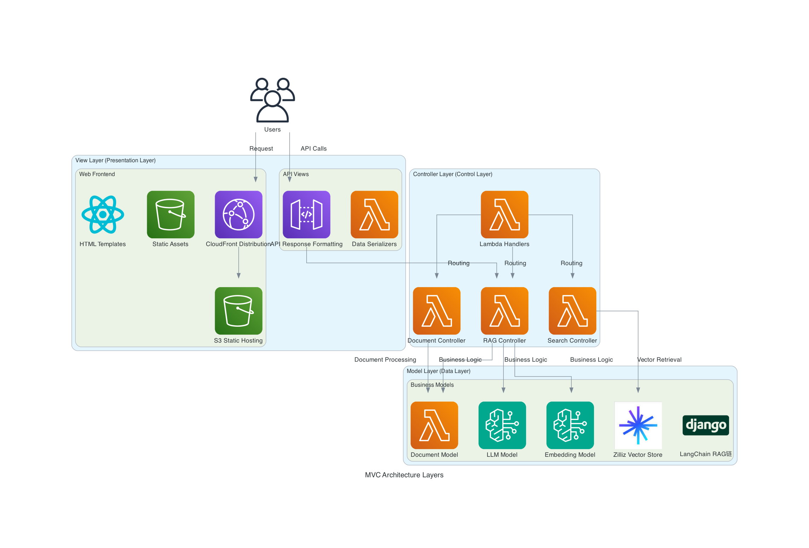
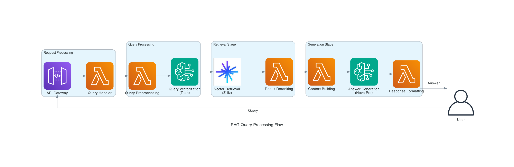

# AWS-Zilliz-RAG 系统

## 项目简介

基于 AWS 和 Zilliz 的企业级 RAG (Retrieval-Augmented Generation) 应用，采用标准 MVC 架构模式，使用 LangChain 框架实现高性能文档检索增强生成系统。

## 快速开始

### 前置要求

- Python 3.9+
- AWS CLI 配置完成
- Node.js 14+ (用于CDK)
- Docker (用于Lambda层构建)
- Make工具

### 环境设置

1. **克隆项目**
```bash
git clone https://github.com/your-org/AWS-Zilliz-RAG.git
cd AWS-Zilliz-RAG
```

2. **安装依赖**
```bash
make install
```

3. **配置环境变量**
```bash
cp .env.example .env
# 编辑 .env 文件，填入你的配置
```

必需的环境变量：
```bash
# AWS配置
AWS_REGION=us-east-1

# Zilliz配置
ZILLIZ_ENDPOINT=your-endpoint
ZILLIZ_TOKEN=your-token
ZILLIZ_COLLECTION=rag_collection

# Bedrock配置 (可选，有默认值)
BEDROCK_MODEL_ID=amazon.nova-pro-v1:0
EMBEDDING_MODEL_ID=amazon.titan-embed-image-v1

# S3配置
S3_BUCKET=rag-storage-bucket
S3_PREFIX=documents/
```

### 🔧 CDK Bootstrap（必需）

**⚠️ 重要：首次部署前必须执行 CDK Bootstrap**

CDK Bootstrap 会创建必要的AWS资源用于部署：
```bash
# 初始化CDK环境（每个账号/区域只需执行一次）
cd infrastructure
npx cdk bootstrap aws://YOUR_ACCOUNT_ID/us-east-1

# 或使用 Make 命令
make bootstrap
```

Bootstrap 会创建：
- S3存储桶（用于存储部署资源）
- IAM角色（用于部署权限）
- SSM参数（存储版本信息）

### 使用 Makefile 命令

本项目使用 Makefile 统一管理所有操作，提供简洁一致的命令接口。

#### 📋 常用命令

```bash
# 查看所有可用命令
make help

# 显示当前配置
make show-config

# 初始化CDK（首次部署必需）
make bootstrap

# 部署应用
make deploy-v2           # 交互式部署（默认目标）

# 开发相关
make test               # 运行测试
make lint               # 代码检查
make type-check         # 类型检查
make ci                 # 完整CI流程

# 清理和维护
make clean              # 清理构建产物
make kill-cdk           # 终止CDK进程（解决进程冲突）

# CDK操作
make synth              # 合成CloudFormation模板
make diff               # 查看栈差异
make destroy            # 销毁AWS资源

# 本地开发
make run-local          # 启动本地API服务器
make logs               # 查看Lambda日志
```

#### 🚀 部署流程

**标准部署**：
```bash
# 1. 检查配置
make show-config

# 2. 运行测试
make test

# 3. 查看将要部署的变更
make diff

# 4. 执行部署
make deploy
```

**快速部署**：
```bash
make deploy-v2 
```


#### 🔧 开发工作流

**日常开发**：
```bash
# 1. 清理环境
make clean

# 2. 运行代码检查
make lint

# 3. 运行测试
make test

# 4. 启动本地服务
make run-local
```

**提交前检查**：
```bash
# 运行完整的CI流程
make ci
```

#### 🚨 故障排除

**CDK进程冲突**：
```bash
# 如果遇到 "Another CLI is currently synthing" 错误
make kill-cdk
make clean
make deploy
```

**查看部署日志**：
```bash
make logs
```

**清理所有资源**：
```bash
make destroy
```

## 项目结构

```
.
├── Makefile            # 🎯 统一命令入口
├── app/                # 应用主目录 (MVC架构)
│   ├── models/         # Model层 - 数据和业务逻辑
│   ├── views/          # View层 - 展示和响应
│   └── controllers/    # Controller层 - 请求处理
├── infrastructure/     # AWS CDK基础设施
│   ├── app.py         # CDK应用入口
│   └── stacks/        # CDK栈定义
├── config/            # 配置文件
├── tests/             # 测试套件
├── docs/              # 文档
│   └── CDK_BEST_PRACTICES.md  # CDK最佳实践
└── scripts/           # 辅助脚本
```

## 架构图生成

本项目使用 Python `diagrams` 库生成专业的架构图表。

### 环境要求

- Python 3.9+
- Graphviz (图形渲染引擎)

### 安装依赖

```bash
# 进入diagrams目录
cd docs/diagrams

# 安装Python依赖
pip install -r requirements.txt

# 安装Graphviz (macOS)
brew install graphviz

# 安装Graphviz (Ubuntu/Debian)
sudo apt-get install graphviz

# 安装Graphviz (CentOS/RHEL)
sudo yum install graphviz
```

### 生成图表

```bash
# 进入项目根目录
cd /Users/umatoratatsu/Documents/AWS/AWS-Handson/AWS-Zilliz-RAG

# 生成所有架构图
python docs/diagrams/generate_all.py

# 或单独生成指定图表
python docs/diagrams/rag_data_flow.py
python docs/diagrams/document_ingestion.py
python docs/diagrams/mvc_architecture.py
```

生成的图表将保存在 `docs/images/` 目录中：
- `rag_data_flow.png` - RAG查询处理流程图  
- `document_ingestion.png` - 文档摄入流程图
- `mvc_architecture.png` - MVC架构层次图

## 系统架构

### MVC 架构层次

| 层次 | 职责 | 主要组件 |
|------|------|----------|
| **View** | 用户界面和数据展示 | Web前端、API响应格式化器 |
| **Controller** | 请求处理和流程控制 | RAG控制器、文档控制器、Lambda处理器 |
| **Model** | 数据处理和业务逻辑 | 文档模型、嵌入模型、向量存储模型、LLM模型 |

### 技术栈

- **语言**: Python 3.9+
- **框架**: LangChain, FastAPI
- **AWS服务**: 
  - Amazon Bedrock (Nova Pro模型用于生成，Titan Multimodal Embeddings用于向量化)
  - AWS Lambda (无服务器计算)
  - Amazon S3 (文档存储)
  - CloudFront (CDN分发)
  - API Gateway (RESTful API)
- **向量数据库**: Zilliz Cloud / Milvus
- **基础设施**: AWS CDK (Python)
- **CI/CD**: GitHub Actions

### 核心组件说明

| 组件 | 技术选型 | 作用 | 性能指标 |
|------|----------|------|----------|
| LLM服务 | Amazon Bedrock Nova Pro | 生成RAG回答 | <3s响应时间 |
| 向量化 | Titan Multimodal Embeddings G1 | 文档和查询向量化 | 1024维向量 |
| 向量数据库 | Zilliz Cloud | 高性能向量检索 | <200ms检索 |
| 文档存储 | Amazon S3 | 原始文档和缓存 | 99.999999999%持久性 |
| 计算服务 | AWS Lambda | 无服务器处理 | 自动扩展 |
| CDN | CloudFront | 全球内容分发 | <100ms延迟 |
| API网关 | API Gateway | RESTful API | 10000 req/s |

## 系统架构图

### MVC架构层次详细



*图：基于MVC模式的应用架构层次*

## 数据流程图

### RAG查询处理流程



*图：从用户查询到答案生成的完整RAG处理流程*

### 文档摄入流程


*图：文档上传、处理、向量化到存储的完整流程*

## API 使用

### 查询接口

```bash
# 发送查询请求
curl -X POST https://your-api-url/query \
  -H "Content-Type: application/json" \
  -d '{
    "query": "什么是RAG？",
    "top_k": 5
  }'
```

### 文档上传

```bash
# 上传文档
curl -X POST https://your-api-url/documents \
  -H "Content-Type: multipart/form-data" \
  -F "file=@document.pdf"
```

## 监控和日志

### CloudWatch 监控

```bash
# 查看实时日志
make logs

# 查看特定函数日志
aws logs tail /aws/lambda/RAG-Query-dev --follow
```

### 性能指标

系统自动收集以下指标：
- API响应时间
- 向量检索延迟
- LLM生成时间
- 错误率和成功率

## 性能优化策略

### 缓存架构
- **L1 内存缓存**: 5分钟TTL，100MB容量
- **L2 Redis缓存**: 1小时TTL，1GB容量  
- **L3 S3缓存**: 1天TTL，无限容量

### 向量检索优化
- IVF_FLAT索引，1024聚类中心
- 批量嵌入生成，32文档/批次
- 异步并行检索，最多10并发

### Lambda优化
- 预留并发：查询100，摄入10
- 内存配置：查询1GB，摄入2GB
- 超时设置：查询30s，摄入300s

## 监控仪表板

### 关键指标
- **查询延迟**: P50 <1s, P95 <3s, P99 <5s
- **成功率**: >99.9%
- **并发用户**: 实时监控
- **向量检索性能**: <200ms
- **LLM生成时间**: <2s

### CloudWatch告警
- 高延迟告警：>3s持续2分钟
- 错误率告警：5xx错误>10/分钟
- Lambda超时告警：超时率>1%
- 成本告警：日消费>预算80%

## 最佳实践

### 安全性

1. **永不硬编码密钥** - 使用环境变量或AWS Secrets Manager
2. **最小权限原则** - IAM角色仅授予必需权限
3. **加密传输** - 所有API通信使用HTTPS
4. **定期轮换密钥** - 定期更新API密钥和令牌

### 性能优化

1. **使用缓存** - 缓存常见查询结果
2. **批量处理** - 批量生成向量嵌入
3. **异步处理** - 长时间运行的任务使用队列
4. **索引优化** - 定期优化Zilliz索引

### 开发规范

1. **代码格式化** - 使用Black和isort
2. **类型提示** - 所有函数使用类型注解
3. **测试覆盖** - 保持80%以上测试覆盖率
4. **文档完整** - 所有公共函数需要docstring

## 故障排除

### 常见问题

**Q: CDK部署时出现进程冲突**
```bash
make kill-cdk  # 终止冲突进程
make clean     # 清理输出目录
make deploy-v2   # 重新部署
```

**Q: Lambda函数超时**
- 检查函数内存配置（建议3008MB）
- 优化向量检索的top_k参数
- 启用Lambda预留并发

**Q: Zilliz连接失败**
- 验证ZILLIZ_ENDPOINT和ZILLIZ_TOKEN
- 检查网络连接和防火墙规则
- 确认集合名称正确

### 获取帮助

如遇到问题，可以：
1. 查看项目文档：
   - [系统架构设计](docs/ARCHITECTURE_DESIGN.md)
   - [架构图表](docs/ARCHITECTURE_DIAGRAMS.md)  
   - [数据模型设计](docs/DATA_MODEL_DESIGN.md)
   - [CDK最佳实践](docs/CDK_BEST_PRACTICES.md)
   - [CloudFront配置指南](docs/CLOUDFRONT_403_FIX.md)
   - [API规范](docs/API_SPECIFICATION.yaml)
2. 查看CloudWatch日志：`make logs`
3. 提交Issue到项目仓库

## 快速部署指南

### 一键部署（开发环境）
```bash
# 克隆项目
git clone <repository>
cd AWS-Zilliz-RAG

# 安装依赖并部署
make install
make bootstrap  # 首次部署必需
make deploy-v2
```

### 生产部署清单
- [ ] 配置生产环境变量
- [ ] 运行完整测试套件 `make ci`
- [ ] 检查安全配置
- [ ] 配置监控告警
- [ ] 准备回滚方案
- [ ] 执行部署 `make deploy-v2`

## 贡献指南

### 开发流程
1. Fork项目并创建功能分支
2. 遵循代码规范（Google Python Style）
3. 编写测试（保持>80%覆盖率）
4. 运行本地测试 `make test`
5. 运行代码检查 `make lint`
6. 提交PR并等待review

### 提交规范
- feat: 新功能
- fix: 修复bug
- docs: 文档更新
- refactor: 代码重构
- test: 测试相关
- chore: 其他修改

### 开发命令
```bash
# 代码质量检查
make lint               # 代码风格检查
make type-check         # 类型检查
make test               # 运行测试
make ci                 # 完整CI流程

# 任务完成提示音
python main.py && afplay /System/Library/Sounds/Sosumi.aiff
```

## 许可证

本项目采用 MIT 许可证 - 详见 [LICENSE](LICENSE) 文件

## 维护者

- [@your-team](https://github.com/your-team)

## 致谢

- [LangChain](https://github.com/langchain-ai/langchain) - RAG框架
- [AWS CDK](https://github.com/aws/aws-cdk) - 基础设施即代码
- [Zilliz](https://zilliz.com) - 向量数据库服务

---

*最后更新：2025年8月*
*版本：2.0.0*