# 架构图表文档

## 1. 系统总体架构图

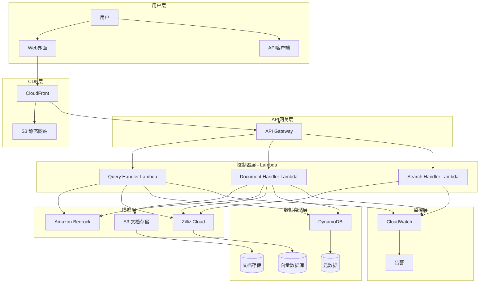

## 2. MVC架构详细图

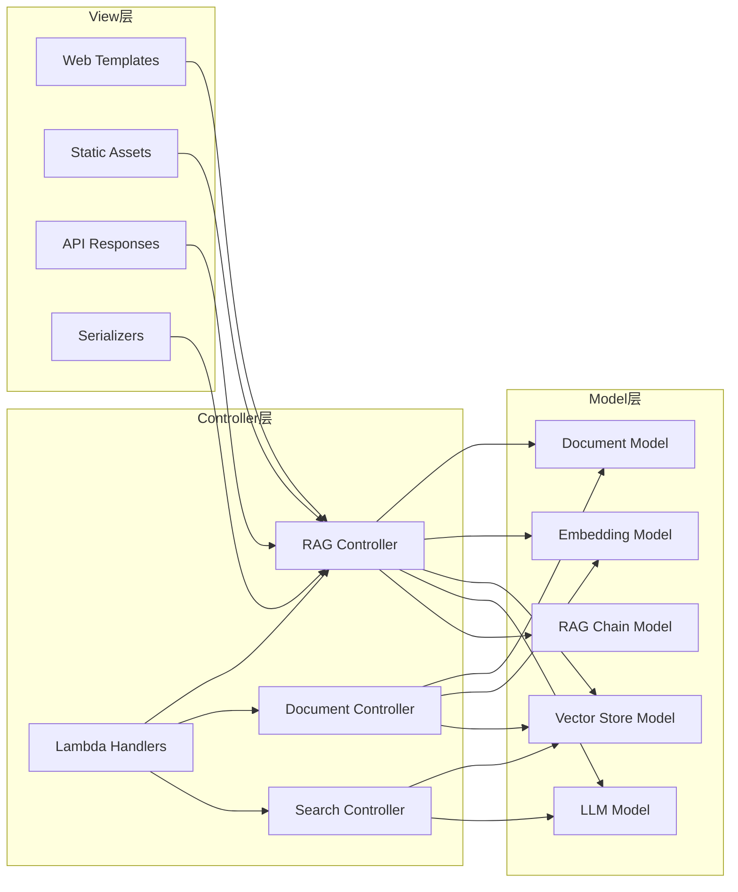

## 3. RAG处理流程图

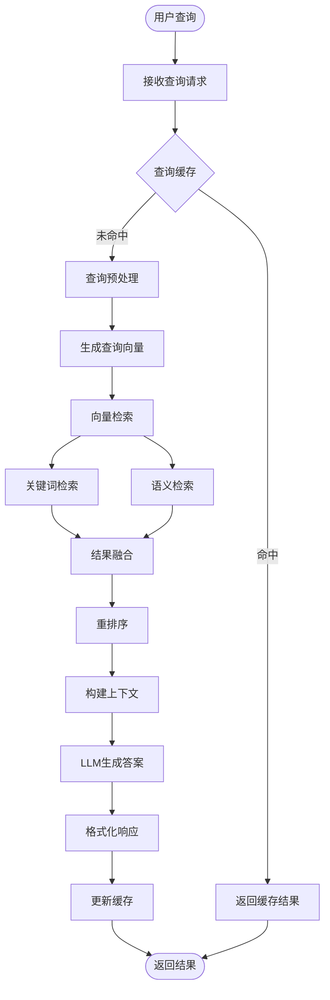

## 4. 文档处理流程图

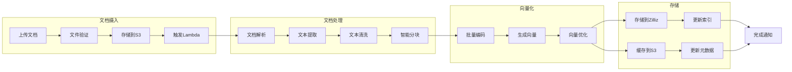

## 5. 部署架构图

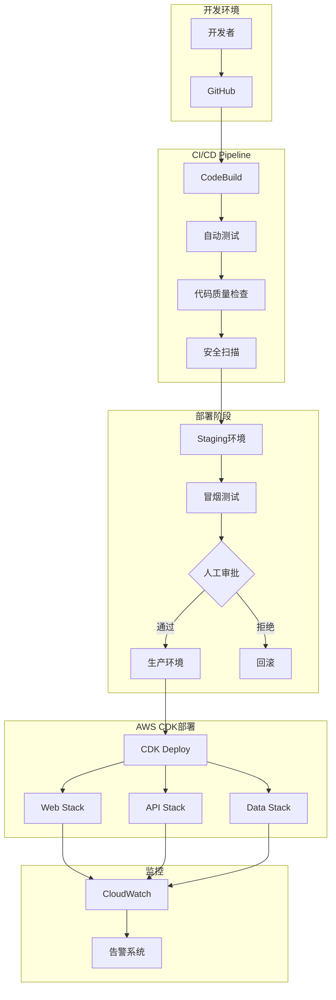

## 6. 数据流图

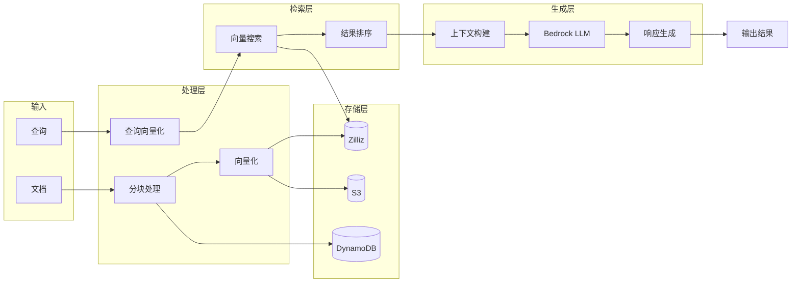

## 7. 安全架构图

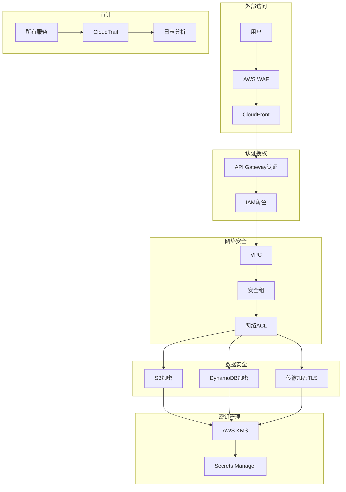

## 8. 扩展性架构图

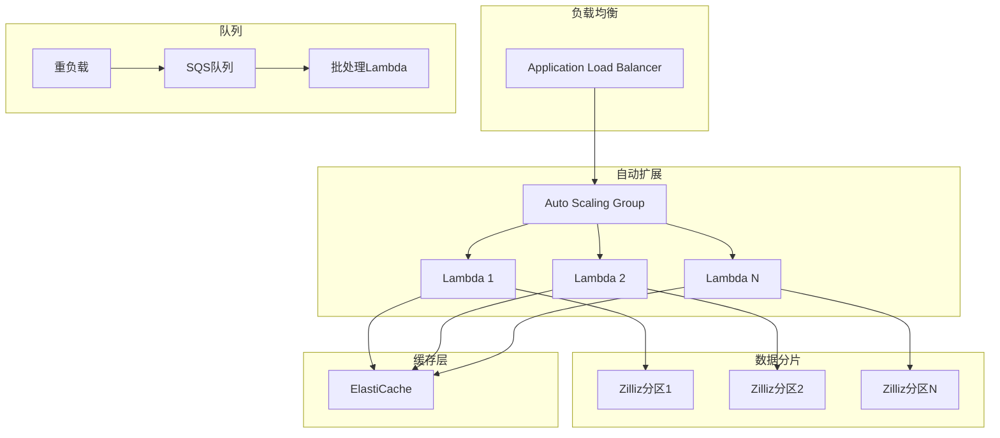

## 9. 监控告警架构

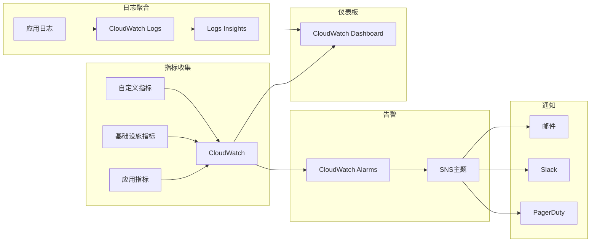

## 10. 灾难恢复架构

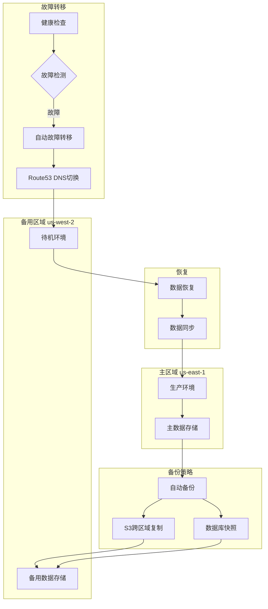

## 11. 性能优化架构

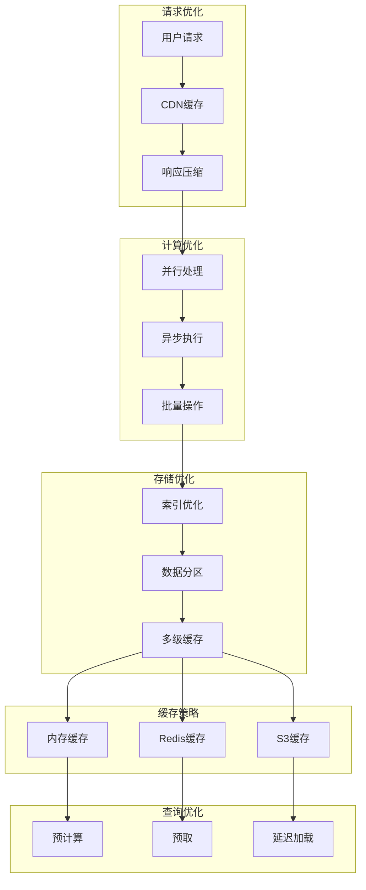

## 12. 成本优化架构

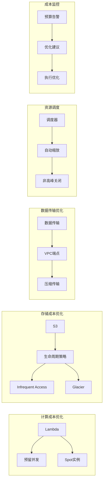

## 图表说明

### 使用说明
1. **系统总体架构图**：展示整个RAG系统的宏观架构
2. **MVC架构详细图**：详细说明MVC三层的组件关系
3. **RAG处理流程图**：描述查询处理的完整流程
4. **文档处理流程图**：说明文档从上传到向量化的流程
5. **部署架构图**：CI/CD和部署流程
6. **数据流图**：数据在系统中的流转路径
7. **安全架构图**：安全防护的多层架构
8. **扩展性架构图**：系统如何实现水平扩展
9. **监控告警架构**：监控和告警系统设计
10. **灾难恢复架构**：高可用和灾难恢复策略
11. **性能优化架构**：性能优化的多个层面
12. **成本优化架构**：成本控制和优化策略

### 技术栈映射
- **前端**：CloudFront + S3
- **API层**：API Gateway + Lambda
- **业务逻辑**：Lambda Functions (Python)
- **AI服务**：Amazon Bedrock
- **向量数据库**：Zilliz Cloud
- **对象存储**：Amazon S3
- **元数据存储**：DynamoDB
- **监控**：CloudWatch
- **IaC**：AWS CDK