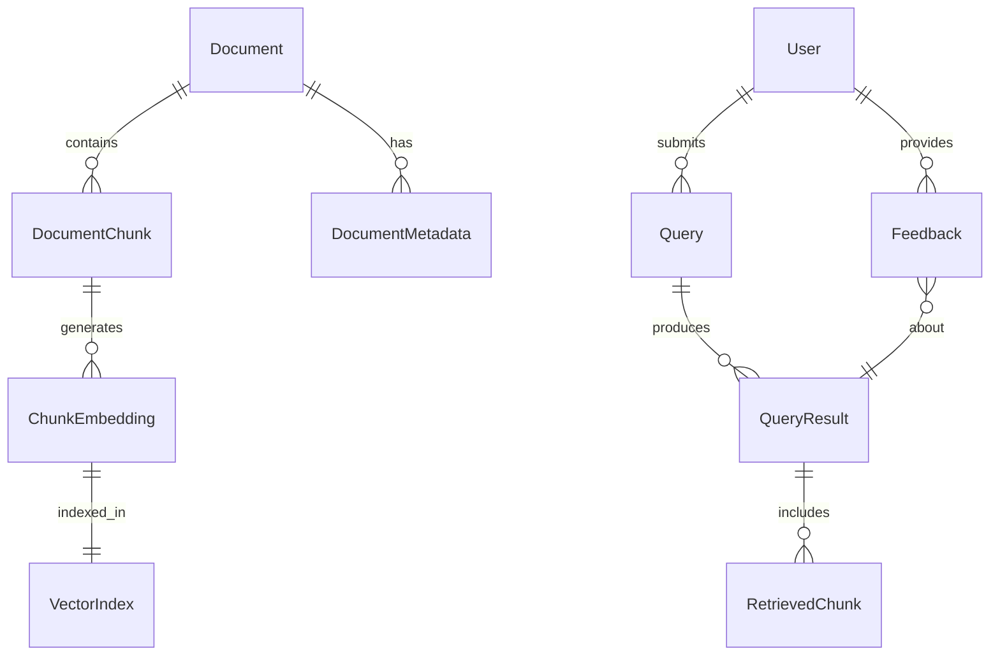

# 数据模型与向量存储架构设计

## 1. 数据模型总览

### 1.1 实体关系图



### 1.2 核心实体定义

| 实体 | 描述 | 存储位置 |
|------|------|----------|
| Document | 原始文档 | S3 + RDS |
| DocumentChunk | 文档分块 | Zilliz + S3 |
| ChunkEmbedding | 向量表示 | Zilliz |
| Query | 用户查询 | DynamoDB |
| QueryResult | 查询结果 | DynamoDB |
| Feedback | 用户反馈 | DynamoDB |

## 2. 向量数据库设计（Zilliz/Milvus）

### 2.1 Collection设计

#### 主Collection: `rag_documents`

```python
from pymilvus import DataType, FieldSchema, CollectionSchema

# 字段定义
fields = [
    FieldSchema(
        name="chunk_id",
        dtype=DataType.VARCHAR,
        max_length=128,
        is_primary=True,
        description="Unique chunk identifier"
    ),
    FieldSchema(
        name="document_id",
        dtype=DataType.VARCHAR,
        max_length=128,
        description="Parent document ID"
    ),
    FieldSchema(
        name="embedding",
        dtype=DataType.FLOAT_VECTOR,
        dim=1024,
        description="Amazon Titan embedding vector"
    ),
    FieldSchema(
        name="content",
        dtype=DataType.VARCHAR,
        max_length=8192,
        description="Chunk text content"
    ),
    FieldSchema(
        name="position",
        dtype=DataType.INT32,
        description="Chunk position in document"
    ),
    FieldSchema(
        name="metadata",
        dtype=DataType.JSON,
        description="Additional metadata"
    ),
    FieldSchema(
        name="created_at",
        dtype=DataType.INT64,
        description="Unix timestamp"
    ),
    FieldSchema(
        name="updated_at",
        dtype=DataType.INT64,
        description="Unix timestamp"
    )
]

# Schema定义
schema = CollectionSchema(
    fields=fields,
    description="RAG document chunks with embeddings",
    enable_dynamic_field=True
)

# 索引配置
index_params = {
    "index_type": "IVF_FLAT",
    "metric_type": "L2",
    "params": {
        "nlist": 1024,
        "nprobe": 16
    }
}
```

#### 辅助Collection: `document_summaries`

```python
# 文档摘要Collection - 用于快速检索
summary_fields = [
    FieldSchema(name="document_id", dtype=DataType.VARCHAR, max_length=128, is_primary=True),
    FieldSchema(name="title", dtype=DataType.VARCHAR, max_length=512),
    FieldSchema(name="summary_embedding", dtype=DataType.FLOAT_VECTOR, dim=1024),
    FieldSchema(name="summary_text", dtype=DataType.VARCHAR, max_length=2048),
    FieldSchema(name="document_type", dtype=DataType.VARCHAR, max_length=32),
    FieldSchema(name="total_chunks", dtype=DataType.INT32),
    FieldSchema(name="metadata", dtype=DataType.JSON)
]
```

### 2.2 分区策略

```python
# 按文档类型分区
partitions = {
    "pdf_documents": "PDF文档分区",
    "text_documents": "文本文档分区",
    "web_content": "网页内容分区",
    "structured_data": "结构化数据分区"
}

# 按时间分区（可选）
time_partitions = {
    "recent": "最近30天",
    "archive_q1": "Q1归档",
    "archive_q2": "Q2归档",
    "archive_q3": "Q3归档",
    "archive_q4": "Q4归档"
}
```

### 2.3 索引优化策略

```python
# 多级索引配置
INDEX_CONFIGS = {
    "small_collection": {  # < 100K vectors
        "index_type": "FLAT",
        "metric_type": "L2"
    },
    "medium_collection": {  # 100K - 1M vectors
        "index_type": "IVF_FLAT",
        "params": {"nlist": 1024, "nprobe": 16}
    },
    "large_collection": {  # 1M - 10M vectors
        "index_type": "IVF_PQ",
        "params": {"nlist": 2048, "m": 8, "nprobe": 32}
    },
    "huge_collection": {  # > 10M vectors
        "index_type": "HNSW",
        "params": {"M": 16, "efConstruction": 200, "ef": 64}
    }
}

# 自动索引选择
def select_index_config(collection_size: int) -> dict:
    if collection_size < 100_000:
        return INDEX_CONFIGS["small_collection"]
    elif collection_size < 1_000_000:
        return INDEX_CONFIGS["medium_collection"]
    elif collection_size < 10_000_000:
        return INDEX_CONFIGS["large_collection"]
    else:
        return INDEX_CONFIGS["huge_collection"]
```

## 3. 关系数据模型（元数据存储）

### 3.1 DynamoDB表设计

#### Table: `rag_documents`

```python
{
    "TableName": "rag_documents",
    "KeySchema": [
        {"AttributeName": "document_id", "KeyType": "HASH"}
    ],
    "AttributeDefinitions": [
        {"AttributeName": "document_id", "AttributeType": "S"},
        {"AttributeName": "user_id", "AttributeType": "S"},
        {"AttributeName": "created_at", "AttributeType": "N"}
    ],
    "GlobalSecondaryIndexes": [
        {
            "IndexName": "user_documents",
            "Keys": [
                {"AttributeName": "user_id", "KeyType": "HASH"},
                {"AttributeName": "created_at", "KeyType": "RANGE"}
            ]
        }
    ],
    "BillingMode": "PAY_PER_REQUEST"
}

# 文档记录示例
{
    "document_id": "doc_abc123",
    "user_id": "user_xyz789",
    "title": "Technical Documentation",
    "type": "pdf",
    "size_bytes": 1048576,
    "s3_location": "s3://bucket/documents/doc_abc123.pdf",
    "status": "processed",
    "chunk_count": 42,
    "created_at": 1704067200,
    "updated_at": 1704067200,
    "metadata": {
        "author": "John Doe",
        "tags": ["technical", "guide"],
        "language": "en",
        "processing_time_ms": 3500
    }
}
```

#### Table: `rag_queries`

```python
{
    "TableName": "rag_queries",
    "KeySchema": [
        {"AttributeName": "query_id", "KeyType": "HASH"}
    ],
    "AttributeDefinitions": [
        {"AttributeName": "query_id", "AttributeType": "S"},
        {"AttributeName": "user_id", "AttributeType": "S"},
        {"AttributeName": "timestamp", "AttributeType": "N"}
    ],
    "GlobalSecondaryIndexes": [
        {
            "IndexName": "user_queries",
            "Keys": [
                {"AttributeName": "user_id", "KeyType": "HASH"},
                {"AttributeName": "timestamp", "KeyType": "RANGE"}
            ]
        }
    ]
}

# 查询记录示例
{
    "query_id": "qry_def456",
    "user_id": "user_xyz789",
    "query_text": "How to implement RAG system?",
    "timestamp": 1704067200,
    "response": {
        "answer": "To implement a RAG system...",
        "sources": ["doc_abc123", "doc_ghi789"],
        "confidence": 0.92
    },
    "metrics": {
        "latency_ms": 450,
        "tokens_used": 1250,
        "retrieval_count": 5
    }
}
```

#### Table: `rag_feedback`

```python
{
    "TableName": "rag_feedback",
    "KeySchema": [
        {"AttributeName": "feedback_id", "KeyType": "HASH"}
    ],
    "AttributeDefinitions": [
        {"AttributeName": "feedback_id", "AttributeType": "S"},
        {"AttributeName": "query_id", "AttributeType": "S"}
    ],
    "GlobalSecondaryIndexes": [
        {
            "IndexName": "query_feedback",
            "Keys": [
                {"AttributeName": "query_id", "KeyType": "HASH"}
            ]
        }
    ]
}
```

## 4. S3存储结构设计

### 4.1 目录结构

```
s3://rag-storage-bucket/
│
├── raw-documents/              # 原始文档存储
│   ├── {user_id}/
│   │   ├── {document_id}/
│   │   │   ├── original.{ext}
│   │   │   └── metadata.json
│   │   └── ...
│   └── ...
│
├── processed-chunks/           # 处理后的文本块
│   ├── {document_id}/
│   │   ├── chunk_0001.json
│   │   ├── chunk_0002.json
│   │   └── ...
│   └── ...
│
├── embeddings-cache/          # 向量缓存（备份）
│   ├── {document_id}/
│   │   ├── embeddings.npy
│   │   └── metadata.json
│   └── ...
│
├── indexes/                   # 索引文件
│   ├── inverted/
│   │   └── {date}/
│   │       └── index.json
│   └── metadata/
│       └── document_index.json
│
└── exports/                   # 导出数据
    ├── daily/
    │   └── {date}/
    └── backups/
        └── {date}/
```

### 4.2 生命周期策略

```python
LIFECYCLE_RULES = {
    "raw_documents": {
        "transition_to_ia": 90,      # 90天后转到IA存储
        "transition_to_glacier": 365, # 1年后转到Glacier
        "expiration": None            # 不自动删除
    },
    "processed_chunks": {
        "transition_to_ia": 30,      # 30天后转到IA存储
        "expiration": 180             # 180天后删除
    },
    "embeddings_cache": {
        "expiration": 30              # 30天后删除（可重新生成）
    }
}
```

## 5. 数据处理流程

### 5.1 文档摄入流程

```python
class DocumentIngestionPipeline:
    """文档摄入处理管道"""
    
    def process(self, document: bytes, metadata: dict) -> str:
        # 1. 文档解析
        text = self.parse_document(document, metadata['type'])
        
        # 2. 文本预处理
        cleaned_text = self.preprocess_text(text)
        
        # 3. 智能分块
        chunks = self.smart_chunking(
            cleaned_text,
            chunk_size=512,
            overlap=50,
            preserve_sentences=True
        )
        
        # 4. 生成向量
        embeddings = self.generate_embeddings(chunks)
        
        # 5. 存储到Zilliz
        chunk_ids = self.store_in_vector_db(chunks, embeddings, metadata)
        
        # 6. 存储元数据
        self.store_metadata(metadata, chunk_ids)
        
        # 7. 缓存到S3
        self.cache_to_s3(chunks, embeddings, metadata)
        
        return document_id
```

### 5.2 智能分块策略

```python
class SmartChunker:
    """智能文档分块器"""
    
    def chunk_document(self, text: str, config: ChunkConfig) -> List[Chunk]:
        chunks = []
        
        # 1. 按段落初步分割
        paragraphs = self.split_paragraphs(text)
        
        # 2. 语义边界检测
        boundaries = self.detect_semantic_boundaries(paragraphs)
        
        # 3. 优化分块大小
        optimized_chunks = self.optimize_chunk_sizes(
            paragraphs,
            boundaries,
            target_size=config.chunk_size,
            max_size=config.max_chunk_size
        )
        
        # 4. 添加上下文重叠
        chunks_with_overlap = self.add_overlap(
            optimized_chunks,
            overlap_size=config.overlap_size
        )
        
        # 5. 生成chunk元数据
        for i, chunk in enumerate(chunks_with_overlap):
            chunks.append(Chunk(
                content=chunk,
                position=i,
                start_char=chunk.start,
                end_char=chunk.end,
                metadata=self.extract_chunk_metadata(chunk)
            ))
        
        return chunks
```

## 6. 查询优化

### 6.1 混合检索策略

```python
class HybridRetriever:
    """混合检索器"""
    
    def retrieve(self, query: str, config: RetrievalConfig) -> List[Document]:
        # 1. 向量检索
        vector_results = self.vector_search(
            query_embedding=self.encode(query),
            top_k=config.vector_top_k
        )
        
        # 2. 关键词检索
        keyword_results = self.keyword_search(
            query=query,
            top_k=config.keyword_top_k
        )
        
        # 3. 语义重排序
        reranked_results = self.semantic_rerank(
            query=query,
            candidates=vector_results + keyword_results,
            model="cross-encoder"
        )
        
        # 4. 多样性优化
        diverse_results = self.maximize_diversity(
            results=reranked_results,
            lambda_param=config.diversity_lambda
        )
        
        # 5. 相关性过滤
        filtered_results = [
            r for r in diverse_results 
            if r.score >= config.min_relevance_score
        ]
        
        return filtered_results[:config.final_top_k]
```

### 6.2 查询缓存策略

```python
class QueryCache:
    """查询缓存管理器"""
    
    def __init__(self):
        self.cache_layers = {
            "l1": MemoryCache(ttl=300, max_size=1000),      # 5分钟内存缓存
            "l2": RedisCache(ttl=3600, max_size=10000),     # 1小时Redis缓存
            "l3": S3Cache(ttl=86400, prefix="query_cache/")  # 1天S3缓存
        }
    
    def get_or_compute(self, query: str, compute_fn: Callable) -> Any:
        # 生成缓存键
        cache_key = self.generate_cache_key(query)
        
        # 多级缓存查找
        for layer_name, cache in self.cache_layers.items():
            result = cache.get(cache_key)
            if result:
                # 提升到更高级缓存
                self.promote_to_higher_caches(cache_key, result, layer_name)
                return result
        
        # 计算结果
        result = compute_fn(query)
        
        # 写入所有缓存层
        for cache in self.cache_layers.values():
            cache.set(cache_key, result)
        
        return result
```

## 7. 性能优化配置

### 7.1 批处理配置

```python
BATCH_PROCESSING = {
    "embedding_generation": {
        "batch_size": 32,
        "max_sequence_length": 512,
        "padding": True,
        "truncation": True
    },
    "vector_insertion": {
        "batch_size": 1000,
        "async_mode": True,
        "consistency_level": "Eventually"
    },
    "document_processing": {
        "parallel_workers": 4,
        "queue_size": 100,
        "timeout": 300
    }
}
```

### 7.2 连接池配置

```python
CONNECTION_POOLS = {
    "zilliz": {
        "min_connections": 5,
        "max_connections": 50,
        "connection_timeout": 10,
        "idle_timeout": 300,
        "retry_on_failure": True,
        "max_retries": 3
    },
    "s3": {
        "max_pool_connections": 50,
        "max_retries": 3,
        "read_timeout": 60,
        "connect_timeout": 10
    },
    "dynamodb": {
        "max_pool_connections": 25,
        "retry_mode": "adaptive",
        "max_attempts": 3
    }
}
```

## 8. 数据一致性保证

### 8.1 事务处理

```python
class TransactionalProcessor:
    """事务处理器"""
    
    async def process_with_transaction(self, operations: List[Operation]):
        transaction_id = self.generate_transaction_id()
        
        try:
            # 1. 开始事务
            await self.begin_transaction(transaction_id)
            
            # 2. 执行操作
            results = []
            for op in operations:
                result = await self.execute_operation(op, transaction_id)
                results.append(result)
            
            # 3. 验证一致性
            if not await self.verify_consistency(results):
                raise ConsistencyError("Data consistency check failed")
            
            # 4. 提交事务
            await self.commit_transaction(transaction_id)
            
        except Exception as e:
            # 5. 回滚事务
            await self.rollback_transaction(transaction_id)
            raise
```

### 8.2 数据同步策略

```python
SYNC_STRATEGY = {
    "vector_to_metadata": {
        "sync_interval": 60,        # 秒
        "batch_size": 100,
        "consistency_check": True
    },
    "cache_invalidation": {
        "strategy": "write_through",
        "invalidation_delay": 0,
        "cascade_invalidation": True
    },
    "backup_sync": {
        "frequency": "hourly",
        "retention_days": 7,
        "cross_region": True
    }
}
```

## 9. 监控指标

### 9.1 关键性能指标

```python
PERFORMANCE_METRICS = {
    "vector_search": {
        "latency_p50": 50,   # ms
        "latency_p95": 200,  # ms
        "latency_p99": 500,  # ms
        "qps": 1000         # queries per second
    },
    "document_ingestion": {
        "throughput": 100,   # docs/minute
        "latency": 5000,    # ms per document
        "success_rate": 0.99
    },
    "storage": {
        "vector_count": "gauge",
        "storage_usage_gb": "gauge",
        "index_size_mb": "gauge"
    }
}
```

### 9.2 健康检查

```python
class HealthChecker:
    """系统健康检查器"""
    
    async def check_system_health(self) -> HealthStatus:
        checks = {
            "zilliz": self.check_zilliz_connection(),
            "s3": self.check_s3_access(),
            "dynamodb": self.check_dynamodb_access(),
            "bedrock": self.check_bedrock_availability()
        }
        
        results = await asyncio.gather(*checks.values())
        
        return HealthStatus(
            overall="healthy" if all(results) else "unhealthy",
            services=dict(zip(checks.keys(), results)),
            timestamp=datetime.utcnow()
        )
```

## 10. 数据迁移策略

### 10.1 版本管理

```python
SCHEMA_VERSIONS = {
    "v1.0": {
        "vector_dim": 768,
        "chunk_size": 256
    },
    "v2.0": {
        "vector_dim": 1024,  # 升级到新的embedding模型
        "chunk_size": 512,
        "migration_script": "migrations/v1_to_v2.py"
    }
}
```

### 10.2 迁移流程

```python
class DataMigrator:
    """数据迁移管理器"""
    
    async def migrate(self, from_version: str, to_version: str):
        # 1. 验证版本兼容性
        if not self.is_compatible(from_version, to_version):
            raise MigrationError("Incompatible versions")
        
        # 2. 创建备份
        backup_id = await self.create_backup()
        
        try:
            # 3. 执行迁移
            await self.execute_migration(from_version, to_version)
            
            # 4. 验证数据完整性
            await self.verify_data_integrity()
            
            # 5. 更新版本信息
            await self.update_version_info(to_version)
            
        except Exception as e:
            # 6. 回滚到备份
            await self.restore_from_backup(backup_id)
            raise
```